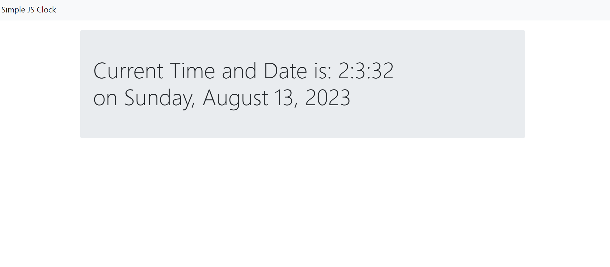

# JS-Clock

The JavaScript Clock is a simple web application that displays the current time in a clean and elegant design. It's a handy tool for quickly checking the time and can be easily integrated into websites or used as a standalone application.

## Features

- **Real-time Display**: The clock updates in real-time, accurately reflecting the current time.
- **Digital Format**: The time is displayed in a digital format, making it easy to read.

## How to Use

1. Open the `index.html` file in your web browser.
2. The clock will automatically display the current time.
3. Enjoy the simple and stylish design that provides you with accurate time information.

## Demo

Experience the JavaScript Clock in action by visiting the live demo [here](https://pandeydhruv2001.github.io/JS-Clock/).

## Installation

To run the JavaScript Clock locally, follow these steps:

1. Clone the repository: `git clone https://github.com/yourusername/js-clock.git`
2. Navigate to the project directory: `cd js-clock`
3. Open the `index.html` file in your preferred web browser.

## Technologies Used

- HTML5
- CSS3
- JavaScript

## Credits

- The clock design and functionality are inspired by various online tutorials and resources.

## License

This project is licensed under the [MIT License](LICENSE).

## Contact

For any inquiries or suggestions, please contact [dp0689@srmist.edu.in](mailto:your@email.com).

Contributions to enhance the clock's features or design are welcome! Feel free to submit pull requests or create issues.

Stay punctual with the stylish JavaScript Clock!
